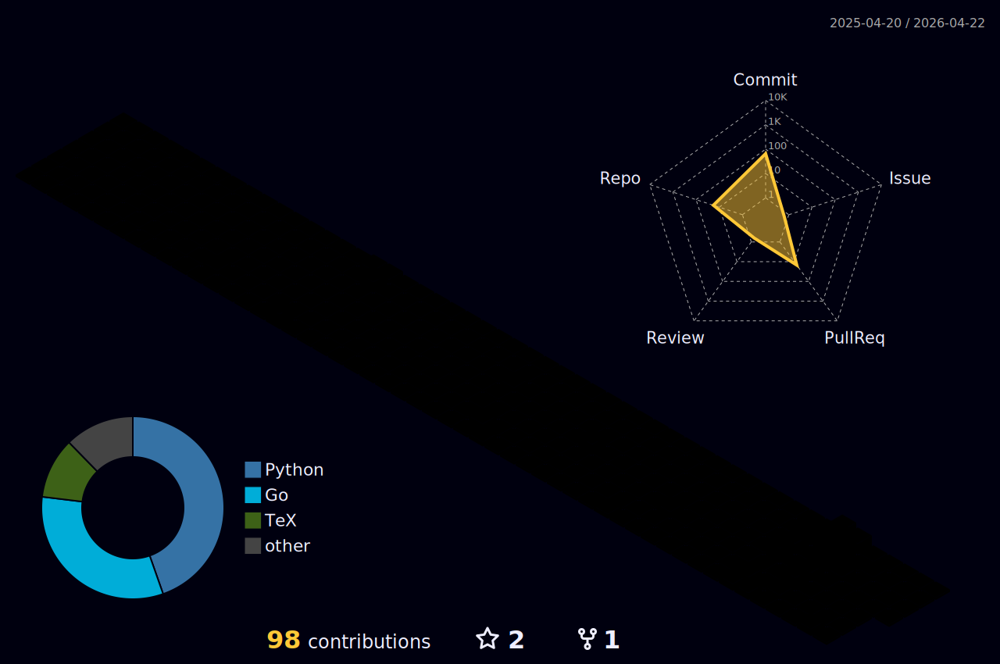

<p align="center">
  
</p>

<p align="center">
  <a href="https://bestsithineu.github.io">
    
  </a>
</p>

<p align="center">
  <a href="https://www.linkedin.com/in/batuhan-edguer/">
    
  </a>
  <a href="https://bestsithineu.github.io">
    
  </a>
  <a href="https://github.com/BestSithInEU">
    
  </a>
  <a href="https://discord.gg/dYKBSHqAdx">
    
  </a>
  <a href="https://instagram.com/batuhanedguer">
    
  </a>
  <a href="mailto:batuhanedguer@gmail.com">
    
  </a>
  
</p>

---

## About Me

ML engineer and AI researcher building end-to-end ML pipelines, fine-tuning LLMs, and deploying anomaly detection systems. Currently pursuing an **M.Sc. in Computer Science** at Yeditepe University with thesis research on **meta-learning for automated research paper analysis**.

```python
class BatuhanEdguer:
    role       = "AI Researcher & ML Engineer"
    location   = "Istanbul, Turkey"
    education  = "M.Sc. CS @ Yeditepe University (GPA: 3.47/4.00)"
    thesis     = "Meta Modeling For AI Solutions Based on Existing AI Configurations"
    research   = ["Meta-Learning", "LLMs & NLP", "Deep Reinforcement Learning", "HPC for ML"]
    languages  = ["Turkish (Native)", "English (Fluent)"]
```

---

## Experience

**Teaching Assistant** — Yeditepe University *(Feb 2023 – Present)*
- Delivering lab sessions for Data Structures, Software Engineering, and AI to **100+ students/semester**
- Built automated grading pipelines, mentored **20+ students** on ML & RL research projects
- Co-developed curriculum integrating PyTorch, HuggingFace, and LLM-based workflows

**Software Engineer & AI Engineer** — New Senses Space Technologies *(Feb 2022 – Aug 2022)*
- Developed anomaly detection models for satellite telemetry using end-to-end ML pipelines
- Designed data ingestion, feature engineering, model training, and deployment infrastructure

---

## Featured Projects

| Project | Description | Stack |
|---------|-------------|-------|
| [**Meta-Learning Research System**](https://github.com/BestSithInEU/ThesisNew) | M.Sc. thesis — extracts metadata from AI papers & recommends optimal model configs. QLoRA fine-tuning (Qwen3-8B), active learning, multi-LLM annotation pipeline | FastAPI, Celery, PostgreSQL, Qdrant, Redis, MLflow, Docker |
| [**Bitcoin Price Prediction**](https://github.com/BestSithInEU/BitcoinPricePrediction) | NLP-driven prediction combining sentiment analysis on news with financial indicators. Benchmarked 18 ML models + CNN/LSTM | TensorFlow, scikit-learn, XGBoost, NLTK |
| [**RL Board Game Agent**](https://github.com/BestSithInEU/rlGame) | Deep Q-learning agent for a 7x7 board game with experience replay, configurable network, PvP/AI modes | Keras, PyQt5 |
| [**Parallel Fractal Renderer**](https://github.com/altugparlak/Fractal-with-threads) | Mandelbrot/Julia renderer comparing OpenMP (CPU), CUDA (GPU), MPI (distributed) | C/C++, Python, PyQt5 |
| [**cc-vox**](https://github.com/BestSithInEU/cc-vox) | TTS plugin for Claude Code — spoken summaries with multi-backend & smart GPU awareness | Python, Qwen3-TTS, Fish Speech, CUDA |
| [**Caelestia**](https://github.com/caelestia-dots/caelestia) | Contributor to a Hyprland-based Linux desktop environment *(2.3k+ stars)* | TypeScript, Shell |

---

## Tech Stack

<p align="center">
  
</p>

<details>
<summary><b>Detailed breakdown</b></summary>
<br/>

| Category | Technologies |
|----------|-------------|
| **Machine Learning** | PyTorch, TensorFlow, Keras, HuggingFace, scikit-learn, XGBoost, LightGBM, vLLM |
| **Languages** | Python, C/C++, Rust, Java, TypeScript, SQL |
| **ML Infrastructure** | Docker, MLflow, FastAPI, Celery, Git, Linux, LaTeX |
| **Parallel Computing** | CUDA, OpenMP, MPI |
| **Databases** | PostgreSQL, Redis, MongoDB, Qdrant |

</details>

---

## GitHub Analytics

<table width="100%">
  <tr>
    <td width="50%">
      <h3 align="center">GitHub Stats</h3>
      <p align="center">
        
      </p>
    </td>
    <td width="50%">
      <h3 align="center">Streak Stats</h3>
      <p align="center">
        
      </p>
    </td>
  </tr>
  <tr>
    <td width="50%">
      <h3 align="center">Top Languages</h3>
      <p align="center">
        
      </p>
    </td>
    <td width="50%">
      <h3 align="center">Trophies</h3>
      <p align="center">
        
      </p>
    </td>
  </tr>
</table>

---

## Contribution Graph

<p align="center">
  
</p>

<p align="center">
  
</p>

---

<p align="center">
  
</p>
